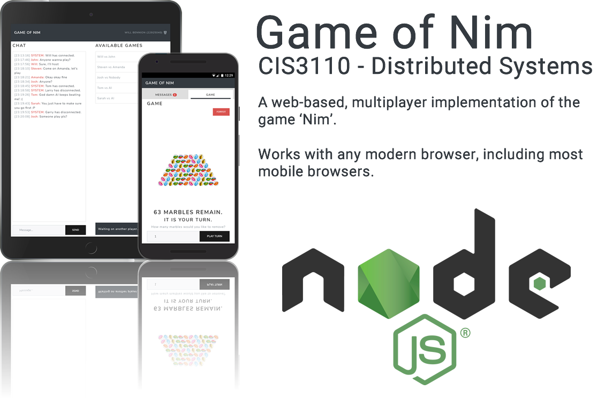

# CIS3110: Distributed Systems - Game of Nim

This is the repository for my CIS3110 coursework implementation.

## Used Libraries

* [Vue, Vue-router, Vuex - Evan You (MIT license)](https://vuejs.org/)
* [jQuery - JS Foundation (MIT license)](https://jquery.org/)
* [Bootstrap - Twitter Inc. (MIT license)](http://getbootstrap.com/)
* [Bootstrap Lux theme - Thomas Park (MIT license)](https://bootswatch.com/lux/)